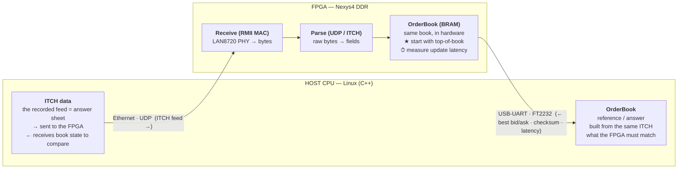

# Building_HFT

**FPGA HFT Environment — Nexys4 DDR + Host (C++)**

An FPGA-based limit order book built in hardware, validated against a software reference.

**First goal:** get the order book *right* in hardware — no strategy, no order placement yet. The host streams a recorded **Nasdaq ITCH** feed into the FPGA, the FPGA rebuilds the book in hardware, reports its state back, and the host checks it against its own software book.

## Architecture

Ethernet carries the ITCH feed in. USB-UART carries the book state & latency back out for comparison.



## Flow

1. **Host → FPGA (Ethernet · UDP):** the host streams the recorded ITCH feed — the "answer sheet."
2. **FPGA Receive (RMII MAC):** the LAN8720 PHY delivers raw bytes to the FPGA.
3. **FPGA Parse (UDP / ITCH):** raw bytes are decoded into ITCH message fields.
4. **FPGA OrderBook (BRAM):** the book is rebuilt in hardware. Start with top-of-book; measure per-update latency.
5. **FPGA → Host (USB-UART · FT2232):** the FPGA reports best bid/ask, a checksum, and latency back to the host.
6. **Host compare:** the host's reference OrderBook (built from the same ITCH) is checked against the FPGA's report.

## Verify   

**Host OrderBook == FPGA OrderBook**, compared via the UART readout.

> Host sends the feed over Ethernet → FPGA rebuilds the book → reports back over UART → host compares.
> No strategy, no orders yet — the first goal is just: get the OrderBook right in hardware.

## Hardware

| Component | Role |
|---|---|
| Nexys4 DDR (Artix-7) | FPGA board |
| LAN8720 PHY (RMII) | Ethernet receive |
| FT2232 | USB-UART readout |

## Protocols

- **Inbound:** Nasdaq ITCH over UDP / Ethernet
- **Outbound:** best bid/ask, checksum, and latency over USB-UART

## Repository layout

```
Building_HFT/
├── README.md      # this file
├── host_cpu/      # C++ software reference order book (the "answer key")
│   ├── src/
│   └── test/
└── fpga/          # SystemVerilog — RMII MAC, UDP/ITCH parser, BRAM order book
```

## Technology stack

SystemVerilog · Xilinx Artix-7 (Nexys4 DDR) · NASDAQ ITCH · Ethernet (RMII) · UDP · BRAM-based order book · C++20 reference · USB-UART verification.